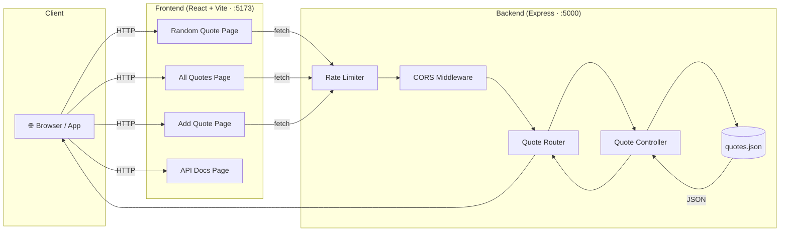

<div align="center">


[](https://git.io/typing-svg)

<br/>

[](LICENSE)
[](https://nodejs.org/)
[](https://expressjs.com/)
[](https://reactjs.org/)
[](https://vitejs.dev/)

[](https://github.com/almostalok/quotevault/stargazers)
[](https://github.com/almostalok/quotevault/network/members)
[](https://github.com/almostalok/quotevault/issues)
[](https://github.com/almostalok/quotevault/commits)

<br/>

> **A free, open-source REST API for inspirational quotes — no auth, no friction, just wisdom.**

[🚀 Quick Start](#-getting-started) · [📚 API Docs](#-api-documentation) · [🐛 Report Bug](https://github.com/almostalok/quotevault/issues) · [✨ Request Feature](https://github.com/almostalok/quotevault/issues)

</div>

---

## 💡 Featured Quote

<div align="center">

> *"The secret of getting ahead is getting started."*
>
> **— Mark Twain**

*✨ Fetch a fresh one anytime:*
```bash
curl http://localhost:5000/api/quotes/random
```

</div>

---

## 📖 Table of Contents

- [About The Project](#-about-the-project)
- [Features](#-features)
- [Tech Stack](#️-tech-stack)
- [Architecture](#️-architecture)
- [Getting Started](#-getting-started)
- [API Documentation](#-api-documentation)
- [Integration Guide](#-integration-guide)
- [Rate Limiting](#️-rate-limiting)
- [Project Structure](#-project-structure)
- [Contributing](#-contributing)
- [License](#-license)
- [Contact](#-contact)

---

## 🎯 About The Project

**QuoteVault** is a full-stack application delivering a **free, zero-auth REST API** for inspirational quotes paired with a beautiful web interface. Whether you're building a motivational app, a Discord bot, a website widget, or just want some wisdom in your terminal — QuoteVault has you covered with **100+ curated quotes** from world-renowned authors and thinkers.

### Why QuoteVault?

| | |
|---|---|
| 🔓 **No Auth Required** | Start immediately — zero API keys or sign-ups |
| 🌐 **CORS Enabled** | Access from any domain, app, or device |
| ⚡ **Lightning Fast** | Powered by Express.js for sub-millisecond responses |
| 🎨 **Beautiful UI** | Glassmorphism web interface included |
| 🛡️ **Rate Limited** | Generous limits that prevent abuse |
| 📚 **100+ Quotes** | Authors, entrepreneurs, scientists, and leaders |
| 💻 **Developer Friendly** | Clean JSON, clear docs, ready-to-copy examples |

### Perfect For

<div align="center">

`🤖 Discord / Slack / Telegram Bots` &nbsp; `📱 Mobile Apps` &nbsp; `🌐 Website Widgets`

`🎓 Learning REST APIs` &nbsp; `📧 Email Newsletters` &nbsp; `🖥️ Terminal Customization` &nbsp; `🎨 Hackathons`

</div>

---

## ✨ Features

<div align="center">

| API | Web Interface |
|-----|---------------|
| ✅ Random inspirational quotes | ✅ One-click quote refresh |
| ✅ Retrieve the full quote library | ✅ Paginated quote browser |
| ✅ Add quotes via POST | ✅ User-friendly "Add Quote" form |
| ✅ RESTful JSON responses | ✅ Interactive API documentation |
| ✅ Rate limiting & security | ✅ Glassmorphism UI design |
| ✅ CORS for cross-origin access | ✅ Fully responsive layout |

</div>

---

## 🛠️ Tech Stack

<div align="center">


</div>

| Layer | Technology | Purpose |
|-------|-----------|---------|
| Runtime | **Node.js v18+** | JavaScript server runtime |
| Framework | **Express.js v4** | HTTP routing & middleware |
| Rate Limiting | **express-rate-limit** | Abuse prevention |
| Frontend | **React 19** | Reactive UI components |
| Bundler | **Vite** | Lightning-fast dev & build |
| Routing | **React Router** | Client-side navigation |
| Database | **JSON File** | Lightweight data persistence |

---

## 🏗️ Architecture



---

## 🚀 Getting Started

### Prerequisites

Before you begin, ensure you have the following installed:
- **Node.js** (v18 or higher)
- **npm** (v9 or higher)

Check your versions:
```bash
node --version
npm --version
```

### Installation

1. **Clone the repository**
   ```bash
   git clone https://github.com/yourusername/quotevault.git
   cd quotevault
   ```

2. **Install backend dependencies**
   ```bash
   cd backend
   npm install
   ```

3. **Install frontend dependencies**
   ```bash
   cd ../frontend
   npm install
   ```

4. **Create environment file (optional)**
   ```bash
   cd ../backend
   touch .env
   ```
   Add the following to `.env`:
   ```env
   PORT=5000
   ```

### Running the Application

#### Option 1: Run Both Servers Separately

**Terminal 1 - Backend Server:**
```bash
cd backend
npm start
```
Backend will run on `http://localhost:5000`

**Terminal 2 - Frontend Development Server:**
```bash
cd frontend
npm run dev
```
Frontend will run on `http://localhost:5173`

#### Option 2: Production Build

```bash
# Build frontend
cd frontend
npm run build

# Serve static files from backend (requires setup)
cd ../backend
npm start
```

### Verify Installation

Open your browser and navigate to:
- **Frontend**: http://localhost:5173
- **API**: http://localhost:5000/api/quotes/random

You should see the QuoteVault interface and a JSON response respectively.

---

## 📚 API Documentation

### Base URL
```
http://localhost:5000/api
```

### Endpoints

| Method | Endpoint | Description | Auth Required |
|--------|----------|-------------|---------------|
| GET | `/quotes/random` | Get a single random quote | No |
| GET | `/quotes` | Get all quotes | No |
| POST | `/quotes` | Add a new quote | No |

---

### Quick Start

#### Get a Random Quote

**Request:**
```http
GET http://localhost:5000/api/quotes/random
```

**Response:**
```json
{
  "id": 42,
  "text": "You are enough just as you are.",
  "author": "Meghan Markle"
}
```

#### Get All Quotes

**Request:**
```http
GET http://localhost:5000/api/quotes
```

**Response:**
```json
[
  {
    "id": 1,
    "text": "The best way to get started is to quit talking and begin doing.",
    "author": "Walt Disney"
  },
  {
    "id": 2,
    "text": "Don't let yesterday take up too much of today.",
    "author": "Will Rogers"
  }
  // ... 98 more quotes
]
```

#### Add a New Quote

**Request:**
```http
POST http://localhost:5000/api/quotes
Content-Type: application/json

{
  "text": "Your amazing quote here",
  "author": "Author Name"
}
```

**Response:**
```json
{
  "id": 101,
  "text": "Your amazing quote here",
  "author": "Author Name"
}
```

---

### Code Examples

<details>
<summary>JavaScript / Node.js</summary>

```javascript
// Get random quote
fetch('http://localhost:5000/api/quotes/random')
  .then(res => res.json())
  .then(quote => console.log(`"${quote.text}" — ${quote.author}`));

// async/await
const response = await fetch('http://localhost:5000/api/quotes/random');
const quote    = await response.json();
```
</details>

<details>
<summary>Python</summary>

```python
import requests

quote = requests.get('http://localhost:5000/api/quotes/random').json()
print(f'"{quote["text"]}" — {quote["author"]}')

# Add a new quote
requests.post('http://localhost:5000/api/quotes', json={
    "text": "Your quote here",
    "author": "Your Name"
})
```
</details>

<details>
<summary>cURL</summary>

```bash
# Random quote
curl http://localhost:5000/api/quotes/random

# All quotes
curl http://localhost:5000/api/quotes

# Add a quote
curl -X POST http://localhost:5000/api/quotes \
  -H "Content-Type: application/json" \
  -d '{"text":"Your quote","author":"Your Name"}'
```
</details>

<details>
<summary>jQuery</summary>

```javascript
$.getJSON('http://localhost:5000/api/quotes/random', quote => {
  $('#quote').text(quote.text);
  $('#author').text(quote.author);
});
```
</details>

---

## 🔌 Integration Guide

<details>
<summary>🌐 <strong>Website Widget</strong> — Add a "Quote of the Day" to any page</summary>

```html
<!DOCTYPE html>
<html>
<head>
  <title>Daily Quote</title>
  <style>
    .quote-container {
      max-width: 600px;
      margin: 50px auto;
      padding: 30px;
      background: #f5f5f5;
      border-radius: 10px;
      box-shadow: 0 4px 6px rgba(0,0,0,0.1);
    }
    .quote-text   { font-size: 1.5rem; font-style: italic; margin-bottom: 15px; }
    .quote-author { font-size: 1.2rem; color: #666; text-align: right; }
  </style>
</head>
<body>
  <div class="quote-container">
    <div class="quote-text"   id="quote-text">Loading...</div>
    <div class="quote-author" id="quote-author"></div>
  </div>
  <script>
    async function loadQuote() {
      try {
        const response = await fetch('http://localhost:5000/api/quotes/random');
        const quote = await response.json();
        document.getElementById('quote-text').textContent   = `"${quote.text}"`;
        document.getElementById('quote-author').textContent = `— ${quote.author}`;
      } catch {
        document.getElementById('quote-text').textContent = 'Failed to load quote';
      }
    }
    loadQuote();
  </script>
</body>
</html>
```
</details>

<details>
<summary>🤖 <strong>Discord Bot</strong> — Reply to <code>!quote</code> with inspiration</summary>

```javascript
const { Client, GatewayIntentBits } = require('discord.js');
const fetch = require('node-fetch');

const client = new Client({
  intents: [
    GatewayIntentBits.Guilds,
    GatewayIntentBits.GuildMessages,
    GatewayIntentBits.MessageContent,
  ]
});

client.on('messageCreate', async (message) => {
  if (message.content === '!quote') {
    try {
      const response = await fetch('http://localhost:5000/api/quotes/random');
      const quote = await response.json();
      message.reply(`"${quote.text}" - **${quote.author}**`);
    } catch {
      message.reply('Failed to fetch quote. Please try again!');
    }
  }
});

client.login('YOUR_BOT_TOKEN');
```
</details>

<details>
<summary>📱 <strong>React Native</strong> — Mobile quote screen</summary>

```javascript
import React, { useState, useEffect } from 'react';
import { View, Text, Button, StyleSheet } from 'react-native';

const QuoteScreen = () => {
  const [quote, setQuote] = useState(null);
  const [loading, setLoading] = useState(false);

  const fetchQuote = async () => {
    setLoading(true);
    try {
      const response = await fetch('http://localhost:5000/api/quotes/random');
      setQuote(await response.json());
    } catch (error) {
      console.error('Error fetching quote:', error);
    } finally {
      setLoading(false);
    }
  };

  useEffect(() => { fetchQuote(); }, []);

  return (
    <View style={styles.container}>
      {quote && (
        <>
          <Text style={styles.quoteText}>"{quote.text}"</Text>
          <Text style={styles.authorText}>— {quote.author}</Text>
        </>
      )}
      <Button title={loading ? 'Loading...' : 'Get New Quote'} onPress={fetchQuote} disabled={loading} />
    </View>
  );
};

const styles = StyleSheet.create({
  container:  { flex: 1, justifyContent: 'center', alignItems: 'center', padding: 20 },
  quoteText:  { fontSize: 20, fontStyle: 'italic', marginBottom: 15, textAlign: 'center' },
  authorText: { fontSize: 16, color: '#666', marginBottom: 30 },
});

export default QuoteScreen;
```
</details>

<details>
<summary>🐦 <strong>Flutter</strong> — Dart / Flutter widget</summary>

```dart
import 'package:flutter/material.dart';
import 'package:http/http.dart' as http;
import 'dart:convert';

class QuoteScreen extends StatefulWidget {
  @override
  _QuoteScreenState createState() => _QuoteScreenState();
}

class _QuoteScreenState extends State<QuoteScreen> {
  String quoteText = 'Loading...';
  String author    = '';
  bool isLoading   = false;

  Future<void> fetchQuote() async {
    setState(() => isLoading = true);
    try {
      final response = await http.get(Uri.parse('http://localhost:5000/api/quotes/random'));
      if (response.statusCode == 200) {
        final quote = json.decode(response.body);
        setState(() { quoteText = quote['text']; author = quote['author']; });
      }
    } catch (e) {
      print('Error: $e');
    } finally {
      setState(() => isLoading = false);
    }
  }

  @override
  void initState() { super.initState(); fetchQuote(); }

  @override
  Widget build(BuildContext context) {
    return Scaffold(
      appBar: AppBar(title: Text('QuoteVault')),
      body: Padding(
        padding: EdgeInsets.all(20),
        child: Column(
          mainAxisAlignment: MainAxisAlignment.center,
          children: [
            Text('"$quoteText"', style: TextStyle(fontSize: 20, fontStyle: FontStyle.italic), textAlign: TextAlign.center),
            SizedBox(height: 15),
            Text('— $author', style: TextStyle(fontSize: 16, color: Colors.grey)),
            SizedBox(height: 30),
            ElevatedButton(onPressed: isLoading ? null : fetchQuote, child: Text(isLoading ? 'Loading...' : 'Get New Quote')),
          ],
        ),
      ),
    );
  }
}
```
</details>

<details>
<summary>🖥️ <strong>Command Line</strong> — Daily wisdom in your terminal</summary>

Add to `~/.bashrc` or `~/.zshrc`:

```bash
echo "💭 Quote of the Day:"
curl -s http://localhost:5000/api/quotes/random | \
  python3 -c "import sys, json; q=json.load(sys.stdin); print(f'\033[1;36m\"{q[\"text\"]}\"\033[0m\n\033[0;33m— {q[\"author\"]}\033[0m')"
```

Or install a standalone `quote` command:

```bash
# Save as ~/bin/quote, then: chmod +x ~/bin/quote
#!/bin/bash
curl -s http://localhost:5000/api/quotes/random | python3 -c "
import sys, json
quote = json.load(sys.stdin)
print(f'\033[1;36m\"{quote[\"text\"]}\"\033[0m\n\033[0;33m— {quote[\"author\"]}\033[0m')
"
```
</details>

---

## 🛡️ Rate Limiting

To ensure fair usage and prevent abuse, the API implements rate limiting:

| Request Type | Limit | Window | Status Code |
|--------------|-------|--------|-------------|
| **GET** requests | 100 requests | 15 minutes | 429 if exceeded |
| **POST** requests | 10 requests | 1 hour | 429 if exceeded |

### Rate Limit Headers

Every API response includes headers with rate limit information:

```http
RateLimit-Limit: 100
RateLimit-Remaining: 95
RateLimit-Reset: 1729206180
```

- **RateLimit-Limit**: Maximum number of requests allowed
- **RateLimit-Remaining**: Number of requests remaining in the current window
- **RateLimit-Reset**: Unix timestamp when the limit resets

### Handling Rate Limits

```javascript
async function fetchWithRateLimit() {
  const response = await fetch('http://localhost:5000/api/quotes/random');
  
  // Check rate limit headers
  const remaining = response.headers.get('RateLimit-Remaining');
  const reset = response.headers.get('RateLimit-Reset');
  
  console.log(`Requests remaining: ${remaining}`);
  
  if (response.status === 429) {
    const resetDate = new Date(parseInt(reset) * 1000);
    console.log(`Rate limit exceeded. Resets at: ${resetDate}`);
    return null;
  }
  
  return await response.json();
}
```

---

## 📁 Project Structure

```
quotevault/
├── backend/
│   ├── controllers/
│   │   └── quoteController.js    # Business logic for quotes
│   ├── routes/
│   │   └── quoteRoutes.js        # API route definitions
│   ├── data/
│   │   └── quotes.json           # Quote database (100 quotes)
│   ├── server.js                 # Express server setup
│   ├── package.json
│   └── .env.example
│
├── frontend/
│   ├── src/
│   │   ├── components/
│   │   │   ├── Header.jsx        # App header
│   │   │   ├── Footer.jsx        # App footer
│   │   │   ├── Plasma.jsx        # Animated background
│   │   │   └── Plasma.css
│   │   ├── pages/
│   │   │   ├── GetRandomQuote.jsx  # Random quote page
│   │   │   ├── GetAllQuote.jsx     # All quotes page
│   │   │   ├── PostQuote.jsx       # Add quote form
│   │   │   └── ApiDocs.jsx         # API documentation
│   │   ├── App.jsx               # Main app component
│   │   ├── main.jsx              # React entry point
│   │   └── index.css             # Global styles
│   ├── index.html
│   ├── package.json
│   └── vite.config.js
│
├── API_DOCUMENTATION.md          # Detailed API reference
├── HOW_TO_USE_API.md            # Integration guide
├── RATE_LIMITING.md             # Rate limiting details
├── api-example.html             # Standalone demo
└── README.md                    # This file
```

---

## 🤝 Contributing

Contributions are what make the open-source community such an amazing place to learn, inspire, and create. **Any contribution you make is warmly welcomed!** 🙌

### How to Contribute

```bash
# 1 · Fork the repo, then clone your fork
git clone https://github.com/YOUR_USERNAME/quotevault.git

# 2 · Create a feature branch
git checkout -b feature/amazing-feature

# 3 · Make your changes, then commit
git commit -m "feat: add amazing feature"

# 4 · Push and open a Pull Request
git push origin feature/amazing-feature
```

### Ways to Contribute

| Type | How |
|------|-----|
| 📝 **Add Quotes** | Web UI at `/add-quote`, or PR to `backend/data/quotes.json`, or POST to the API |
| 🐛 **Fix Bugs** | Open an issue first, then submit a PR |
| ✨ **New Features** | Open a feature-request issue to discuss first |
| 📖 **Docs** | Improve examples, fix typos, add translations |
| 🎨 **UI/UX** | Enhance the React frontend design |

### Guidelines

- Quotes should be inspirational and appropriately attributed — verify the source before submitting (a quick search for `"quote text" + author name` works well)
- Follow the existing code style
- Test your changes before submitting
- Update relevant documentation

---

## 📄 License

Distributed under the **MIT License** — see [`LICENSE`](LICENSE) for full details.

---

## 📧 Contact

Have a question or idea? [Open an issue](https://github.com/almostalok/quotevault/issues) — contributions and feedback are always welcome.

Project Link: [https://github.com/almostalok/quotevault](https://github.com/almostalok/quotevault)

---

## 🙏 Acknowledgments

- [Express.js](https://expressjs.com/) — Fast, unopinionated web framework
- [React](https://reactjs.org/) — A JavaScript library for building user interfaces
- [Vite](https://vitejs.dev/) — Next-generation frontend tooling
- [express-rate-limit](https://github.com/nfriedly/express-rate-limit) — Rate-limiting middleware
- [DenverCoder1/readme-typing-svg](https://github.com/DenverCoder1/readme-typing-svg) — Animated typing SVG
- [kyechan99/capsule-render](https://github.com/kyechan99/capsule-render) — Dynamic header render
- All the inspiring authors whose wisdom powers QuoteVault ✨

---

<div align="center">


**Made with ❤️ by developers, for developers**

[](https://github.com/almostalok/quotevault)
&nbsp;
[](https://github.com/almostalok/quotevault/fork)

*If QuoteVault sparked a little inspiration in your day, consider leaving a ⭐ — it means the world!*

</div>
